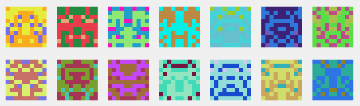

Blockies
========

A tiny library for generating blocky identicons.



[**Demo page**](http://download13.github.io/blockies/)

Browser
---

```javascript
import { createIcon } from '@download/blockies';

var icon = createIcon({ // All options are optional
    seed: 'randstring', // seed used to generate icon data, default: random
    color: '#dfe', // to manually specify the icon color, default: random
    bgcolor: '#aaa', // choose a different background color, default: white
    size: 15, // width/height of the icon in blocks, default: 10
    scale: 3 // width/height of each block in pixels, default: 5
});

document.body.appendChild(icon); // icon is a canvas element
```

In the above example the icon will be 15x15 blocks, and each block will be 3x3 pixels. The icon canvas will be 45x45 pixels.

Node
---

```javascript
import { createCanvas } from 'canvas'; 
import { renderIcon } from '@download/blockies';

const canvas = createCanvas(50, 50);

var icon = renderIcon(
    { // All options are optional
        seed: 'randstring', // seed used to generate icon data, default: random
        color: '#dfe', // to manually specify the icon color, default: random
        bgcolor: '#aaa', // choose a different background color, default: white
        size: 15, // width/height of the icon in blocks, default: 10
        scale: 3 // width/height of each block in pixels, default: 5
    },
    canvas
);
```


Notes
-----

The defaults of size 10 and scale 5 generate 50x50 pixel icons. Below are some standard sizes that work well. A size larger than 10 will start generating more noisy icons that don't ressemble much.
 * 24x24 `{size: 8, scale: 3}`
 * 32x32 `{size: 8, scale: 4}`
 * 48x48 `{size: 12, scale: 4}`


Alternative Styles
------------------

 * https://github.com/alexvandesande/blockies - More colors and alien faces


Build
-----

    npm run build

License
-------

[WTFPL](http://www.wtfpl.net/)