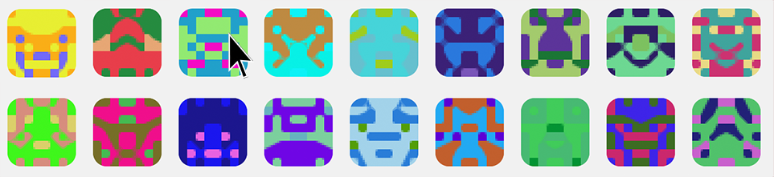

Blockies
========

A tiny library for generating blocky identicons.



[**Demo page**](http://download13.github.io/blockies/)

Use
---

```javascript
var icon = blockies.create({ // All options are optional
    seed: 'randstring', // seed used to generate icon data, default: random
    color: '#dfe', // to manually specify the icon color, default: random
    bgcolor: '#aaa', // choose a different background color, default: random
    size: 15, // width/height of the icon in blocks, default: 8
    scale: 3, // width/height of each block in pixels, default: 4
    spotcolor: '#000' // each pixel has a 13% chance of being of a third color, 
    // default: random. Set to -1 to disable it. These "spots" create structures
    // that look like eyes, mouths and noses. 
});

document.body.appendChild(icon); // icon is a canvas element
```

In the above example the icon will be 15x15 blocks, and each block will be 3x3 pixels. The icon canvas will be 45x45 pixels.


Notes
-----

The defaults of size 8 and scale 4 generate 32x32 pixel icons. Below are some standard sizes that work well. A size larger than 10 will start generating more noisy icons that don't ressemble much.

 * 24x24 `{size: 8, scale: 3}`
 * 50x50 `{size: 5, scale: 10}`


Build
-----

    node build
All this does is minify `blockies.js` to `blockies.min.js`.


License
-------

[WTFPL](http://www.wtfpl.net/)
